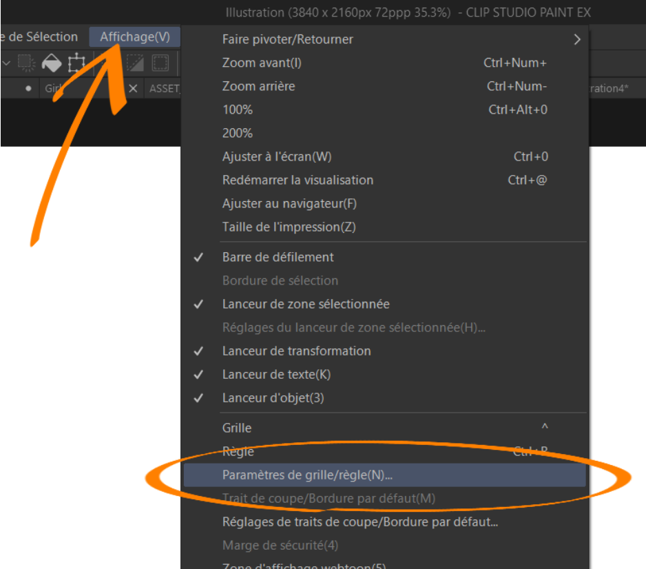
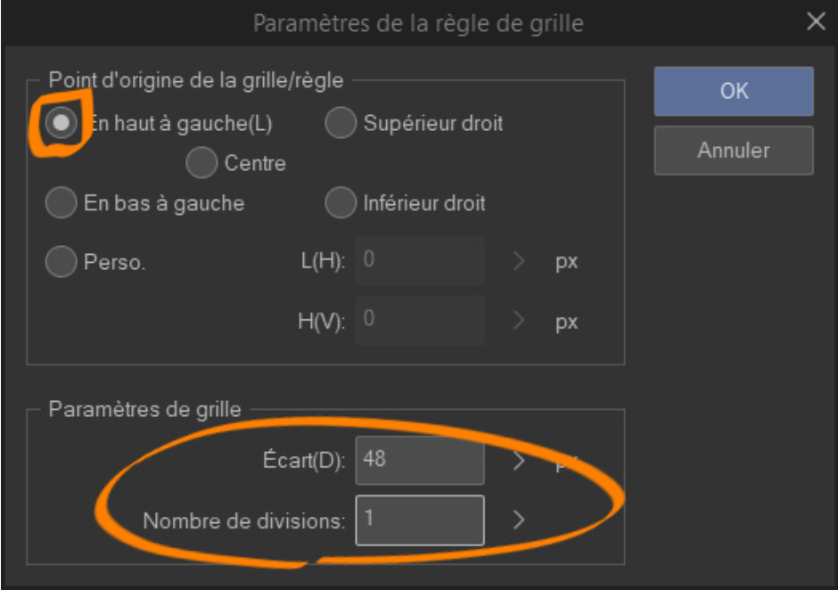
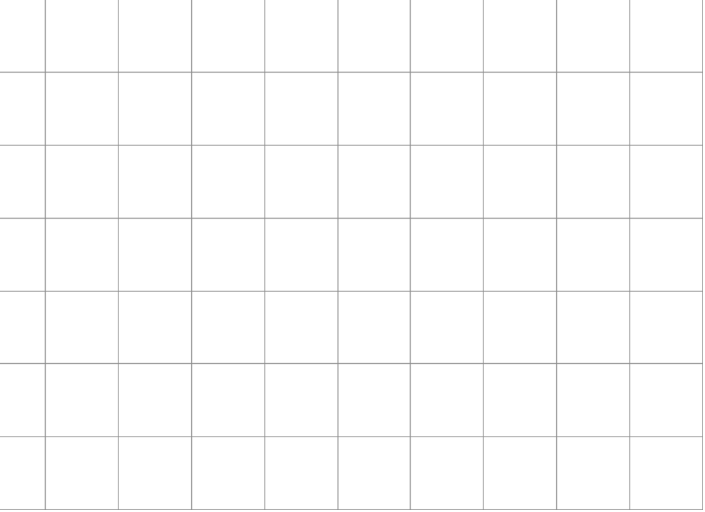
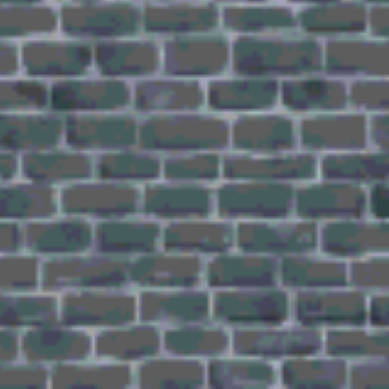

 

## `Git Gud`
### Process pour faire de beaux parallax sur rpg maker. `CSP Version x.xx`
 

---

 

### `1 Créer la grille de reference pour la map.`
 

 

- ### Ouvrir l’onglet `Affichage`.
- ### Ouvrir la fenêtre `Paramètres de la grille/règle`.
  

 

 

- ### Définir le point d’origine de la grille `En haut à gauche`...
- ### Définir l’écart de la grille `48 pixels`.
  - La taille d'un tile pour RPG MAKER MV.
- ### Définir le nombre de subdivision d’un tile à `1`
  - 1 = pas de subdivision.
  

 

 

- ### Cette grille va permettre de placer les objets dessus et savoir où le joueur rencontrera les collisions.
- ### Et VOILA !
  

 

---

 

### `2 Créer un motif de texture pour les tiles.`
 

 

- ### Selectionner une `texture` au choix.
  

 